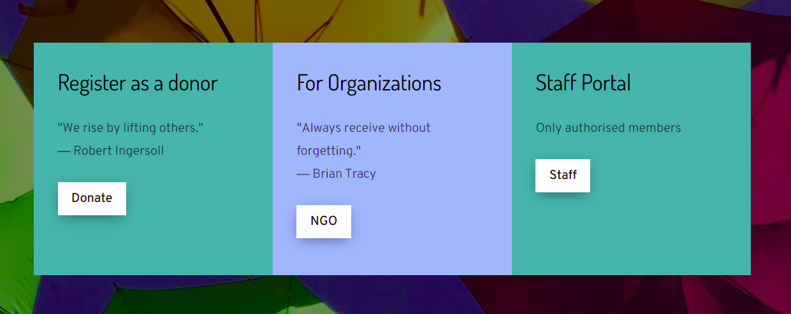

#  Usaidizi 
## Authors
Lorraine,Ernest,John,Hannah,Dennis and Gilbert
## Description
Usaidizi is an Online charity management system that helps charity organizations get funding and donors easily.A user can register as an Admin, NGO or Donor. NGOs can register and request for donations while Donors can register and make donations on requests approved by an admin.
### Screenshot

### Setup/Installation Requirements
* Ensure you have Python3.8 installed.
* Clone the Online charity management system directory using https://github.com/WambiruL/online-charity-management
* Create your own virtual environment and activate it using these respective commands `python3.8 -m venv --without-pip virtual` and  `source virtual/bin/activate`
* Install all the necessary dependencies necessary for running the application using this command `pip install -r requirements.txt`
* Open the terminal and run this command `psql` You can then create a database by running this command
`CREATE DATABASE charity`
* Run migrations using these respective commmands `python3.8 manage.py makemigrations projects` then `python3.8 manage.py migrate`
* Run the app using this command `python3.8 manage.py runserver` on the terminal.You can then open the app on your browser.
## BDD
The program lets a user register
* Input: Submit registration form
* Output: User receives a welcome email

The program lets the user login
* Input: Submit login form
* Output: Displays user Profile 

The program lets a user make requests or donations depending on the type of user.
* Input: Click on 'Make requests'/'Make donations ' button
* Output: Redirects user to a form that helps him/her Make requests or donations

## Technologies Used
* Python-Django - Used django as a framework.
* HTML5- To display the content
* CSS- Cascading styles for styling the html
* Heroku- To host the application
* Github- To host the source code and the live link
* Postgress SQL
## Support and contact details
Reach us on: usaidizi@usaidizi.com
## Live Link
https://online-charity-management.herokuapp.com/

### MIT License

Copyright (c) 2021 

Permission is hereby granted, free of charge, to any person obtaining a copy of this software and associated documentation files (the "Software"), to deal in the Software without restriction, including without limitation the rights to use, copy, modify, merge, publish, distribute, sublicense, and/or sell copies of the Software, and to permit persons to whom the Software is furnished to do so, subject to the following conditions:

The above copyright notice and this permission notice shall be included in all copies or substantial portions of the Software.

THE SOFTWARE IS PROVIDED "AS IS", WITHOUT WARRANTY OF ANY KIND, EXPRESS OR IMPLIED, INCLUDING BUT NOT LIMITED TO THE WARRANTIES OF MERCHANTABILITY, FITNESS FOR A PARTICULAR PURPOSE AND NONINFRINGEMENT. IN NO EVENT SHALL THE AUTHORS OR COPYRIGHT HOLDERS BE LIABLE FOR ANY CLAIM, DAMAGES OR OTHER LIABILITY, WHETHER IN AN ACTION OF CONTRACT, TORT OR OTHERWISE, ARISING FROM, OUT OF OR IN CONNECTION WITH THE SOFTWARE OR THE USE OR OTHER DEALINGS IN THE SOFTWARE.

To adopt MIT License, enter your details. You’ll have a chance to review before committing a LICENSE file to a new branch or the root of your project.
